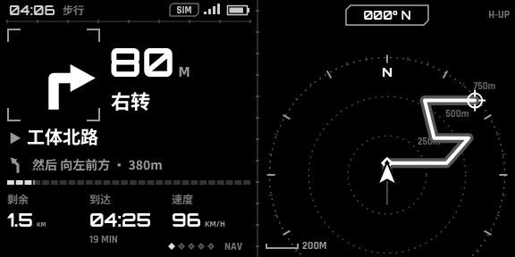
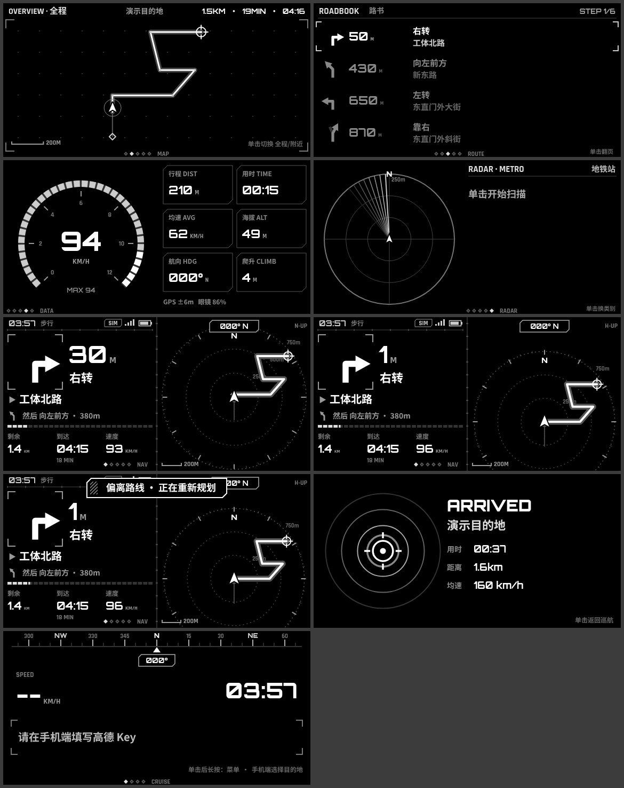
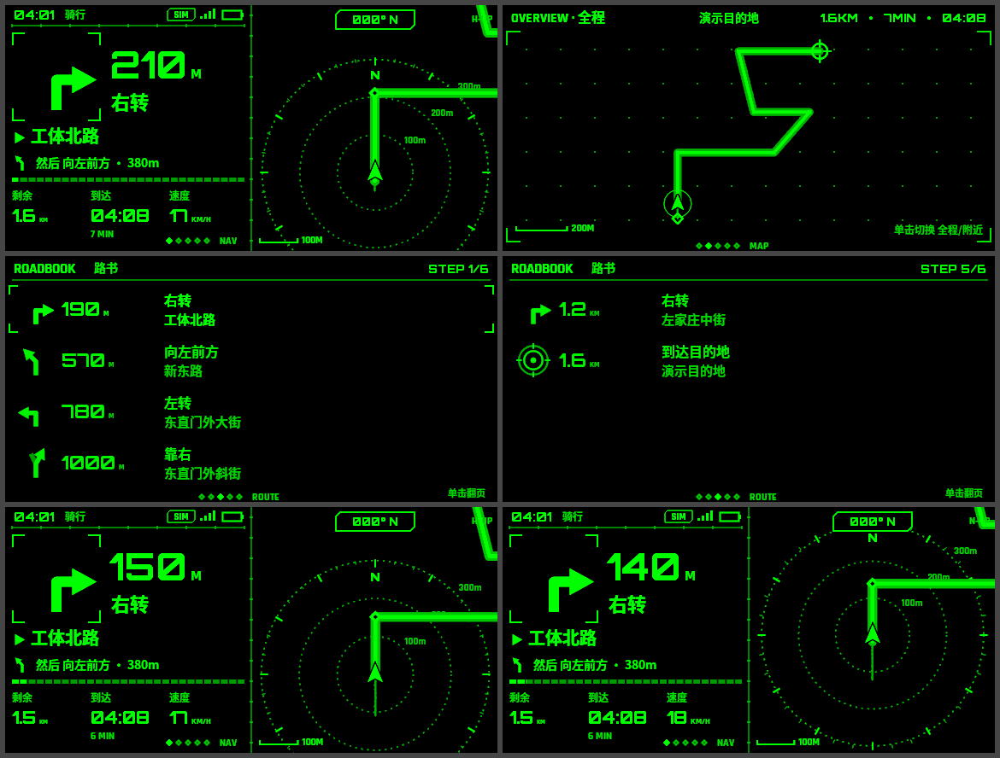
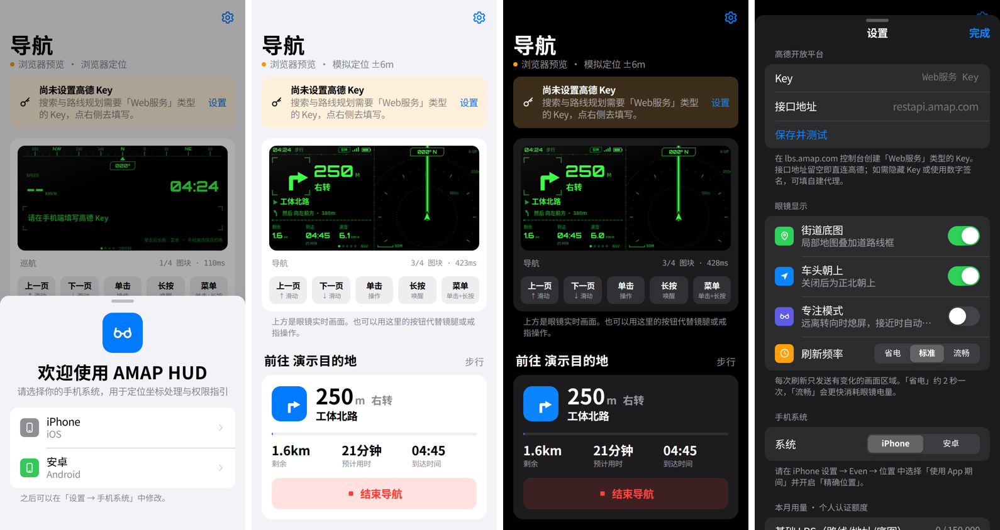

# AMAP HUD · Even G2 高德导航

基于 Even Hub SDK + 高德 Web 服务 API，在 Even Realities G2 眼镜上显示科幻风格的导航 HUD。手机端界面按 Apple HIG 设计。



📦 **安装与测试**：见 [docs/INSTALL.md](docs/INSTALL.md)。可以直接从 [Releases](../../releases) 下载 `.ehpk`。

## 眼镜端视图

在眼镜上前后滑动切换视图，单击执行当前视图的操作，单击后长按打开系统菜单，双击退出。

| 视图 | 内容 | 单击 |
|---|---|---|
| 导航 NAV | 转向图标与距离、要进入的道路、"然后…"预告、进度条、剩余/到达/速度；右半屏是局部雷达地图（距离环、罗盘刻度、街道底图、转向点、终点准星） | 切换车头朝上/正北朝上 |
| 全局 MAP | 全程路线总览（已走/未走、转向点、起终点、当前位置），ETA | 切换 全程/附近 |
| 路书 ROUTE | 后续 4 个路段 | 翻页 |
| 仪表 DATA | 分段速度表；行程、用时、均速、海拔、航向、爬升；GPS 精度、眼镜电量、天气 | — |
| 周边 RADAR | 扫描线雷达 + 最近 5 个地点（地铁/公交/卫生间/便利店/咖啡/餐饮/加油/充电/停车） | 扫描 / 切换类别 |
| 巡航 CRUISE（无路线时） | 航向带、速度、时钟、天气、当前街道、指向起点的返航箭头 | 刷新位置 |
| 到达 ARRIVED | 到达动画 + 行程总结 | 返回巡航 |

系统菜单（单击后长按）里有：结束导航、重新规划、专注模式、地图朝向、街道底图、周边扫描、返回起点。

其他功能：
- **偏航自动重算**：持续偏离路线超过阈值约 4 秒后触发，两次重算至少间隔 15 秒。
- **专注模式**：离下一个转向较远时只在左上角留一个小角标；快到转向时自动亮起完整 HUD，长按可临时唤醒。
- **文本兜底**：宿主有一个已知缺陷，退出确认框弹出后再取消，图片通道会失效。检测到后自动改用纯文本 HUD，导航不中断。

## 开发

```bash
npm install
npm run dev            # http://<局域网IP>:5173
npm run qr             # 生成二维码，用 Even App 扫码在眼镜上加载
npm test               # 单元测试（坐标转换、路线解析、路线跟踪、偏航、到达）
npm run pack           # 构建并打包 amaphud.ehpk
```

- **浏览器预览**：打开 `http://localhost:5173/?mock=1`，用模拟的眼镜运行。
  - 键盘操作：↑↓ 切换视图，Enter 单击，L 长按，D 双击。
- **开发参数**（界面上不显示）：`?demo=walking|bicycling|electrobike|driving`，启动后沿一条离线合成路线自动模拟导航，方便在没有 Key、没有定位的情况下调试。
- **官方模拟器**：`npm run sim`。它带自动化接口，地址是 `http://127.0.0.1:9898`，可以截图和发送输入。
- **局域网预览**：`scripts/lan-preview.sh start`，同时启动手机端网页和官方模拟器，模拟器通过 noVNC 在浏览器里查看。这个脚本依赖本机解压在 `~/.local` 下的 WebKit 和 TigerVNC。
- **首次打开**：会让用户选择 iPhone 或安卓，用来处理定位坐标和显示对应的权限设置指引；之后可以在「设置 → 手机系统」中修改。

## 高德 Key

到 [lbs.amap.com](https://lbs.amap.com) 控制台创建 **「Web服务」** 类型的 Key，然后在手机端"设置"里填写。也可以在构建时写进 `.env.local` 的 `VITE_AMAP_KEY`。

`restapi.amap.com` 支持跨域，WebView 里可以直接调用，不需要自建后端。如果想隐藏 Key 或启用数字签名，可以在设置里填一个自建代理地址。

个人认证的免费额度（2025-05 新政策，按月计，自认证起 1 年有效，仅限非商业用途）：

| 服务包 | 月额度 | 本应用的用途 | 调用策略 |
|---|---|---|---|
| 基础 LBS | 15 万次 | 路线规划、逆地理编码、静态底图 | 底图移出图片中心 30% 范围才重新拉取，且至少间隔 20 秒；逆地理编码在巡航时约 60 秒一次，导航时 5 分钟一次 |
| 基础搜索 | 5000 次 | 地点搜索、周边 | 只在提交搜索或手动扫描时调用；周边结果缓存 5 分钟 / 200 米 |
| 天气 | 5000 次 | 天气 | 30 分钟一次 |

设置页会显示本机统计的用量。请求串行发出，间隔 350ms，用来适配个人开发者很低的 QPS。

## 截图

眼镜端各视图（浏览器渲染，16 级灰度）：



官方模拟器：



手机端（浅色 / 深色）：



## 架构

```
src/
  app.ts               核心控制器：定位 → 路线跟踪 → 偏航重算 → 视图/输入/菜单 → 渲染；处理生命周期
  amap/api.ts          高德 REST 客户端（限流、配额计数、错误码翻译）
  nav/route.ts         解析 v5 路径规划结果为路线模型（累计里程、分段、转向归一化）
  nav/tracker.ts       定位吸附到路线、计算进度与 ETA、判定偏航和到达
  nav/location.ts      宿主/浏览器定位 → GCJ-02，补算速度和航向并平滑；模拟行驶
  nav/trip.ts          行程统计与面包屑轨迹
  glasses/display.ts   显示驱动：2×2 共 4 个 288×144 图块，16 级灰度量化，只发变化的图块，串行发送并合并帧；暂停与探测式恢复；文本兜底
  glasses/input.ts     输入归一化（CLICK=0 被省略、事件去重、滑动节流）
  glasses/bridge.ts    真实桥接 / Mock 桥接
  hud/views.ts         各视图渲染（Canvas 576×288）
  hud/basemap.ts       静态地图处理成暗底线框，只存在内存里
  phone/ui.ts          手机端 UI（iOS 风格）
```

## 已知限制与待真机验证

- 还没有用真实 Key 调用过高德接口。解析逻辑按官方文档的字段结构编写，并用合成数据测试过。
- 静态底图的道路提取阈值没有对照真实图片调过。如果效果不好，会自动回退到边缘检测线框；也可以在设置里关掉底图。
- iPhone 和安卓的系统定位都是 WGS-84，统一在本地转换为 GCJ-02。如果之后发现某个宿主直接返回 GCJ-02，可以按系统单独调整。
- 官方模拟器只显示亮/灭两级，真机是 16 级灰度，暗色元素在真机上的层次需要实际确认。
