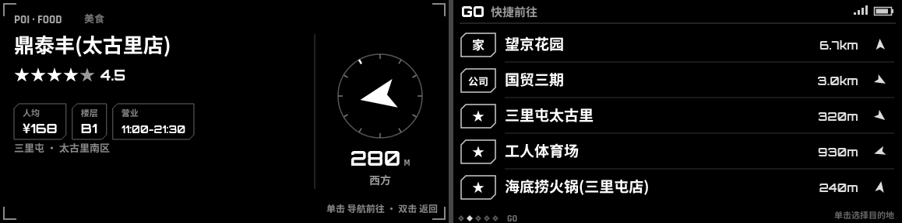
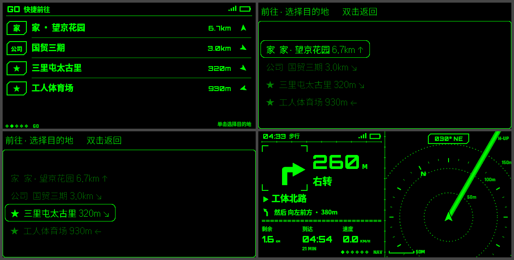
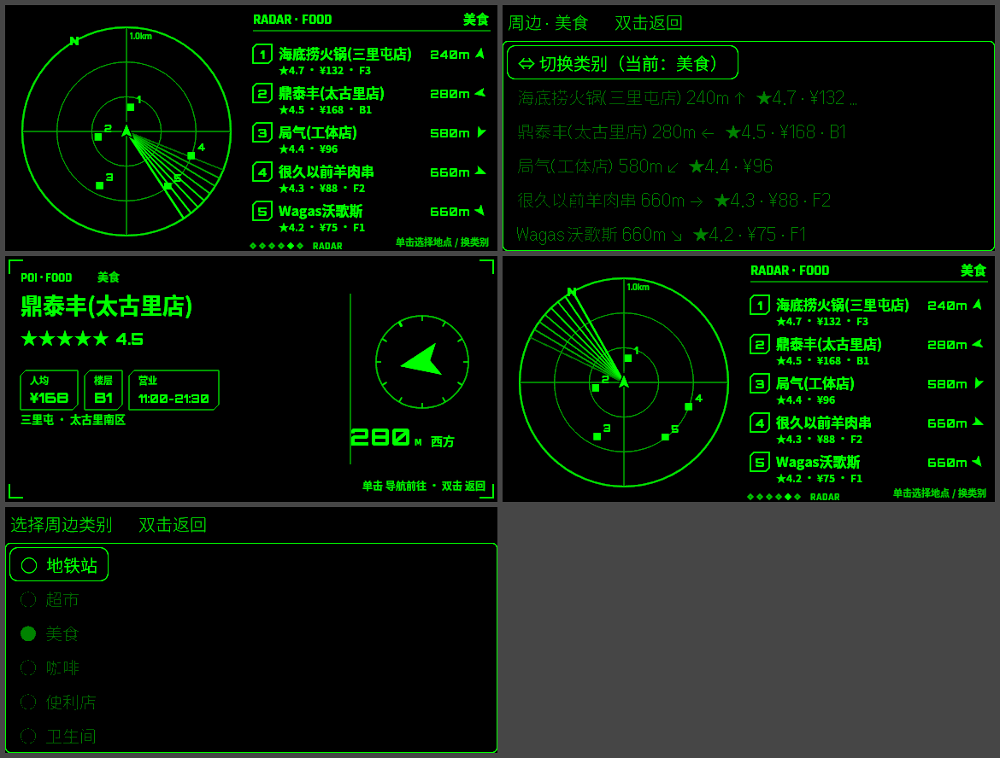

# AMAP HUD · Even G2 高德导航

基于 Even Hub SDK + 高德 Web 服务 API，在 Even Realities G2 眼镜上显示科幻风格的导航 HUD。手机端界面按 Apple HIG 设计。


📦 **安装与测试**：见 [docs/INSTALL.md](docs/INSTALL.md)。可以直接从 [Releases](../../releases) 下载 `.ehpk`。

## 功能一览

### 导航
- 支持步行、骑行、电动车、驾车。驾车路线会显示红绿灯数、过路费，拥堵路段在地图上用虚线标出。
- 转向指引：转向图标、距离、要进入的道路，以及"然后…"的下一个转向预告。
- 局部雷达地图：可选车头朝上或正北朝上；带距离环、罗盘刻度和街道底图；按车速自动缩放。
- 全局地图：全程总览或附近，区分已走和未走的路段。
- 路书：后续路段列表，可翻页。
- 偏航自动重算：持续偏离约 4 秒后触发，两次重算至少间隔 15 秒。
- 到达检测和行程总结。
- 专注模式：离转向较远时几乎熄屏，接近转向时自动亮起。

### 在眼镜上选目的地（不用掏手机）
- 「前往」页列出家、公司、你在手机上加的眼镜快捷点（最多 8 个），以及最近去过的地方，每项显示实时距离和方向。
- 单击打开固件原生列表：滑动移动高亮，单击确认后直接规划并开始导航，使用默认出行方式。

### 周边筛选
- 类别：地铁站、超市、美食、咖啡、便利店、卫生间、公交站、加油站、充电站、停车场。
- 雷达图显示最近 5 个地点的方位。列表里显示 **评分 ★、人均 ¥、楼层（F3 / B1）**。
- 单击进入地点列表，再选一个进入**详情卡**：星级评分、人均、楼层、今日营业时间、商圈、地址、相对方向和距离。
- 详情卡上单击直接导航。目的地使用高德提供的 **入口坐标**，比用 POI 中心点更准。
- 列表第一项可以切换类别。
- 说明：评分是高德的数据，只对餐饮、酒店、景点、影院返回；楼层只对有室内图的商场店铺返回。

### 其他
- 仪表：速度表、行程、用时、均速、最高速度、海拔、航向、爬升、GPS 精度、眼镜电量、天气。
- 巡航（没开导航时）：航向带、当前街道、时钟天气、指回起点的返航箭头；菜单里可以「返回起点」直接导航回去。
- 文本兜底：宿主有一个已知缺陷，退出确认框弹出后再取消，图片通道会失效。检测到后自动改用纯文本 HUD，导航不中断。

## 眼镜上的操作

| 手势 | 作用 |
|---|---|
| 前滑 / 后滑 | 切换视图；在列表里是移动高亮 |
| 单击 | 执行当前视图的操作；在列表里是选中 |
| 单击后长按 | 系统菜单 |
| 长按 | 专注模式下临时唤醒 |
| 双击 | 在列表或详情卡里是返回；在主界面是退出（会弹出确认） |

| 视图 | 内容 | 单击 |
|---|---|---|
| 导航 NAV | 转向 + 局部雷达地图 | 切换地图朝向 |
| 全局 MAP | 路线总览 / 轨迹 | 全程 ⇄ 附近 |
| 路书 ROUTE | 后续 4 个路段 | 翻页 |
| 仪表 DATA | 速度表与行程数据 | — |
| 周边 RADAR | 雷达 + 最近 5 个地点（评分 / 人均 / 楼层） | 打开地点列表 |
| 前往 GO | 家 / 公司 / 快捷点 / 最近 | 打开目的地列表 |
| 巡航 CRUISE | 航向带、地址、天气、返航 | 刷新位置 |
| 详情 POI | 评分、人均、楼层、营业时间、方向距离 | 导航前往 |

系统菜单里有：结束导航、重新规划、专注模式、地图朝向、街道底图、周边扫描、返回起点、快捷前往。

## 手机端

- 首次打开选择 iPhone 或安卓，用来显示对应系统的定位权限指引；之后可以在设置里修改。
- 眼镜画面实时镜像，下方的按钮可以代替镜腿或戒指操作。
- 地点搜索：结果显示评分、人均、楼层和距离。地点面板里可以选出行方式、对比多条路线、查看营业信息，还可以「设为家 / 设为公司 / 加到眼镜」。
- 眼镜快捷点：可以编辑、删除，最多 8 个。
- 设置：高德 Key（带测试按钮）、可选的代理地址、街道底图、车头朝上、专注模式、刷新频率、本月配额用量、诊断信息。
- 浅色和深色模式都适配，遵循 Apple HIG。

## 截图

眼镜端（浏览器渲染，16 级灰度）：


地点详情卡与「前往」页：



官方模拟器：「前往」流程（快捷点 → 原生列表 → 开始导航）



官方模拟器：周边筛选（雷达 → 地点列表 → 详情卡 → 返回 → 切换类别）



手机端：


## 高德 Key

到 [lbs.amap.com](https://lbs.amap.com) 控制台创建 **「Web服务」** 类型的 Key，然后在手机端"设置"里填写。也可以在构建时写进 `.env.local` 的 `VITE_AMAP_KEY`。

`restapi.amap.com` 支持跨域，WebView 里可以直接调用，不需要自建后端。如果想隐藏 Key 或启用数字签名，可以在设置里填一个自建代理地址。

个人认证的免费额度（2025-05 新政策，按月计，自认证起 1 年有效，仅限非商业用途）：

| 服务包 | 月额度 | 本应用的用途 | 调用策略 |
|---|---|---|---|
| 基础 LBS | 15 万次 | 路线规划、逆地理编码、静态底图 | 底图移出图片中心 30% 范围才重新拉取，且至少间隔 20 秒；逆地理编码在巡航时约 60 秒一次，导航时 5 分钟一次 |
| 基础搜索 | 5000 次 | 地点搜索、周边 | 只在提交搜索或手动扫描时调用；周边结果按类别缓存 5 分钟 / 200 米 |
| 天气 | 5000 次 | 天气 | 30 分钟一次 |

请求串行发出，间隔 350ms，用来适配个人开发者很低的 QPS。设置页会显示本机统计的用量。

## 开发

```bash
npm install
npm run dev            # http://<局域网IP>:5173（手机扫码时加 HMR_HOST=<IP>）
npm run qr             # 生成二维码，用 Even App 扫码在眼镜上加载
npm test               # 单元测试：坐标转换、路线解析、路线跟踪、偏航、到达、POI 字段
npm run pack           # 构建并打包 amaphud.ehpk
```

- **浏览器预览**：打开 `http://localhost:5173/?mock=1`，用模拟的眼镜运行。键盘操作：↑↓ 切换视图，Enter 单击，L 长按，D 双击。
- **开发参数**（界面上不显示）：
  - `?demo=walking|bicycling|electrobike|driving`：沿一条离线合成路线自动模拟导航。
  - `?seed=1`：填入示例的家、公司、快捷点和带评分的周边结果。没有 Key 时，从眼镜发起的规划会改用离线路线。
  - 这两个参数可以组合使用，方便在没有 Key、没有定位时调试。
- **官方模拟器**：`npm run sim`。它带自动化接口，地址是 `http://127.0.0.1:9898`，可以截图和发送输入。
- **局域网预览**：`scripts/lan-preview.sh start`，同时启动手机端网页和官方模拟器，模拟器通过 noVNC 在浏览器里查看。这个脚本依赖本机解压在 `~/.local` 下的 WebKit 和 TigerVNC。

## 架构

```
src/
  app.ts               核心控制器：定位 → 路线跟踪 → 偏航重算 → 视图/输入/菜单/列表选择 → 渲染；处理生命周期
  amap/api.ts          高德 REST 客户端（限流、配额计数、错误码翻译、POI 评分/楼层/入口解析）
  nav/route.ts         解析 v5 路径规划结果为路线模型（累计里程、分段、转向归一化）
  nav/tracker.ts       定位吸附到路线、计算进度与 ETA、判定偏航和到达
  nav/location.ts      宿主/浏览器定位 → GCJ-02，补算速度和航向并平滑
  nav/trip.ts          行程统计与面包屑轨迹
  glasses/display.ts   显示驱动：2×2 共 4 个 288×144 图块，16 级灰度量化，只发变化的图块，串行发送并合并帧；
                       原生列表选择页；暂停与探测式恢复；文本兜底
  glasses/input.ts     输入归一化（CLICK=0 被省略、列表选中项、事件去重、滑动节流）
  glasses/bridge.ts    真实桥接 / Mock 桥接
  hud/views.ts         各视图渲染（Canvas 576×288）
  hud/basemap.ts       静态地图处理成暗底线框，只存在内存里
  phone/ui.ts          手机端 UI（iOS 风格）
```

## 已知限制

- 静态底图的道路提取阈值没有对照真实图片调过。如果效果不好，会自动回退到边缘检测线框；也可以在设置里关掉底图。
- 官方模拟器只显示亮/灭两级，真机是 16 级灰度，暗色元素在真机上的层次需要实际确认。
- 高德的个人认证 Key 只能用于非商业用途，公开上架需要企业认证并获得商用授权。

## License

MIT
